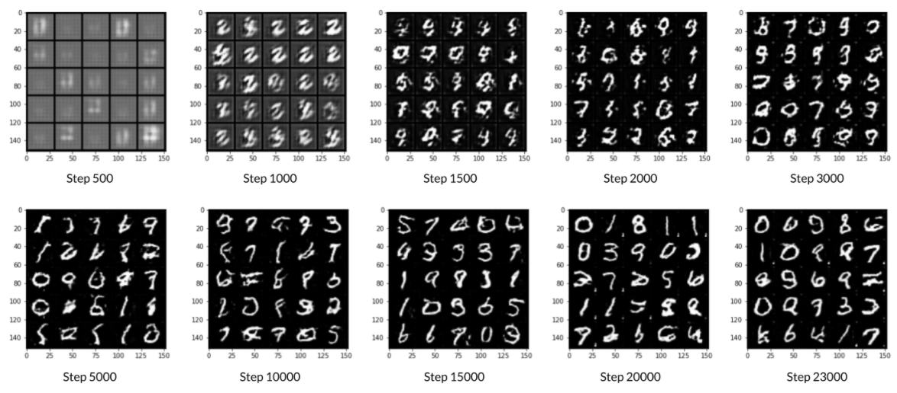
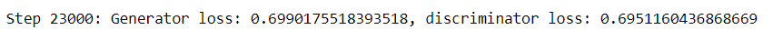

# Deep Convolutional Generative Adversarial Networks (GANs) for MNIST

## Learning Objectives
1. Get hands-on experience making a widely used GAN: Deep Convolutional GAN (DCGAN).
2. Train a powerful generative model.

## Generated Images

## Training Result

