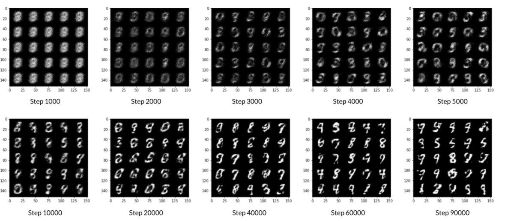
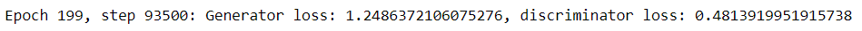

# Generative Adversarial Networks (GANs) for hand-written digits

## Learning Objectives
1.   Build the generator and discriminator components of a GAN from scratch.
2.   Create generator and discriminator loss functions.
3.   Train the GAN and visualize the generated images.

## Generated Images

## Training Result

